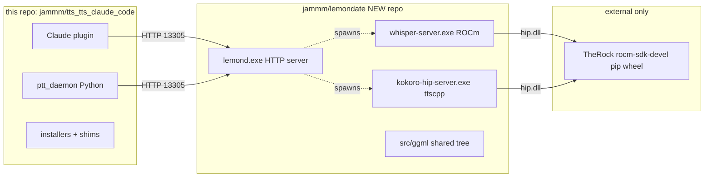
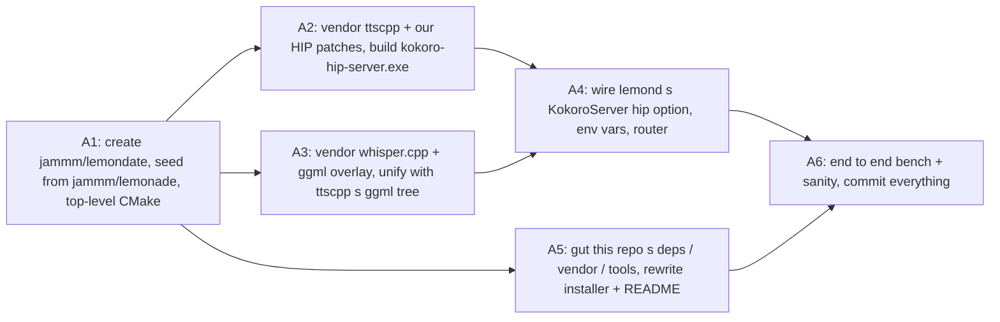

# lemondate monorepo split

Create a new `jammm/lemondate` GitHub repo that absorbs everything currently coming out of `deps/{lemonade, whisper.cpp, llama.cpp, koboldcpp}` as first-class source (no submodules, no GitHub-release downloads at runtime). lemondate builds `lemond.exe` + a whisper-ROCm server + a koboldcpp-HIP Kokoro server from one tree; its only external dep is TheRock's ROCm SDK. This repo (`tts_tts_claude_code`) keeps the Claude plugin + installer + PTT daemon; its installer calls into lemondate's prebuilt artifacts. Parallelised across 4 subagents.

## Todos

| id | status | description |
|---|---|---|
| `a1_scaffold` | pending | **A1 SEQUENTIAL** Create `jammm/lemondate` empty repo; seed from `jammm/lemonade` `jam/windows-rocm-whisper` branch (our existing lemonade fork with the `WhisperServer` rocm patch). Establish top-level `CMakeLists.txt` with a `src/` layout (`src/lemond`, `src/whisper`, `src/ttscpp`, `src/ggml`, `assets/`). Add a root `build.cmd` that builds all three binaries (`lemond`, `whisper-server`, `kokoro-hip-server`) with one invocation. Drop lemonade's `install_backend` download-from-github logic so binaries are always found in local install tree. |
| `a2_ttscpp_embed` | pending | **A2 PARALLEL** Copy `deps/koboldcpp/otherarch/ttscpp/` into `lemondate/src/ttscpp/`. Port our kokoro-HIP patches (128-byte alignment in `tts_model::set_tensor` + `post_load_assign`, reciprocal rewrite, `set_inputs` `ggml_backend_tensor_set` switch, `window_cpu_cache`, shared backend pattern) from `jam/gfx1201-hip` `8fac50bf7`. Port `snake_1d` fused megakernel (`snake.cu`) + `ttscpp_ops.cu` (CUDA kernels for mod / cumsum_tts / ttsround / reciprocal / upscale_linear / conv_transpose_1d_tts / stft / istft) from `e97ae3f80` and today's in-flight work. Write a new `src/kokoro-hip-server/main.cpp` that spawns a `cpp-httplib` server exposing `/v1/audio/speech` by calling ttscpp's `generate()` path. |
| `a3_whisper_ggml_unify` | pending | **A3 PARALLEL** Copy `deps/whisper.cpp` into `lemondate/src/whisper/`. Replace whisper's bundled ggml with our unified `src/ggml/` (from `deps/llama.cpp/ggml` + our kcpp dirtypatch ops `GGML_OP_SNAKE_1D` / `MOD` / `CUMSUM_TTS` / `STFT` / `ISTFT` / `upscale_linear` / `conv_transpose_1d_tts` / `reciprocal` / `ttsround`). Ensure `whisper-server.exe` still builds + runs with the unified ggml. Wire `whisper-server.exe` into lemondate's CMake as a first-class target. Resolve any conflicts where whisper's ggml version differs from llama.cpp's. |
| `a5_this_repo_cleanup` | pending | **A5 PARALLEL** Delete `deps/{koboldcpp, whisper.cpp, llama.cpp, lemonade}` submodules + `.gitmodules` entries. Delete `vendor/{lemonade-cpp, whisper-cpp-rocm, koboldcpp-rocm}`. Delete `tools/build_lemonade_cpp.cmd`, `build_whisper_hip.cmd`, `build_koboldcpp_hip.cmd`, `launch_kobold_rocm.py`. Merge `run_lemonade.ps1.tmpl` + `run_kobold.ps1.tmpl` into a single `run_lemond.ps1.tmpl` (lemondate's single binary). Rewrite `installers/install_windows.ps1` to take `-LemondatePath` and render the merged shim. Update `README.md` bootstrap section for the new two-repo flow. |
| `a4_lemond_wiring` | pending | **A4 SEQUENTIAL (needs A2+A3)** Extend `KokoroServer::get_install_params` with `hip` backend option (returns empty repo/filename, like `WhisperServer`'s `rocm`). Extend `KokoroServer::load` to handle `kokoros_backend=hip` by launching `kokoro-hip-server.exe` from `LEMONADE_KOKORO_HIP_BIN`. Add env var plumbing for `LEMONADE_KOKORO_BACKEND` + `LEMONADE_KOKORO_HIP_BIN` + `LEMONADE_KOKORO_ARGS` to `config_file.cpp` (parallel to `LEMONADE_WHISPERCPP_*` we already added). Set `ROCBLAS_USE_HIPBLASLT=1` inside lemond's process environment at startup (alt: inside the `kokoro-hip-server.exe` / `whisper-server.exe` startup) so we don't need a shim layer to do it. |
| `a6_integrate_bench` | pending | **A6 SEQUENTIAL** End-to-end bench on this dev box (Threadripper + RX 9070 XT gfx1201). Verify new `kokoro-hip-server.exe` matches current `koboldcpp_hipblas.dll` numbers (0.37s median, 1.30s poem). Verify whisper ROCm still works. Verify `speak.py`'s `services.json` routing picks the right port when `lemond` spawns `kokoro-hip-server`. Audio quality sanity-check (correlation of same-input-different-RNG outputs vs CPU baseline; catches any STFT/iSTFT/conv_transpose kernel bugs we may have reintroduced — today's debug run caught correlation=0.04 on the current build, must fix before lemondate inherits). Bump submodule pointer references, commit + push both repos. |

## End state

No more `deps/` submodules in this repo. lemondate is NOT a submodule of this one either; users install lemondate separately (or we download a prebuilt release).

## What goes into lemondate

Seed from current [deps/lemonade](../deps/lemonade) (already on `jam/windows-rocm-whisper` — has our `WhisperServer` rocm-backend patches). Then vendor in:

| Source tree | Lives at in lemondate | From |
|---|---|---|
| lemonade C++ server | `src/lemond/` | current deps/lemonade, verbatim |
| whisper.cpp | `src/whisper/` | deps/whisper.cpp + our overlay from deps/llama.cpp/ggml |
| ttscpp (Kokoro only for now) | `src/ttscpp/` | deps/koboldcpp/otherarch/ttscpp/ + our kokoro-HIP patches |
| Shared ggml + ggml-cuda | `src/ggml/` | current deps/llama.cpp/ggml, plus our `snake.cu`, `ttscpp_ops.cu`, `GGML_OP_SNAKE_1D` + stft/istft/upscale_linear/conv_transpose_1d_tts additions |
| embd_res / phonemizer data | `assets/` | from deps/koboldcpp/embd_res/ |

One shared `src/ggml/` tree — whisper-server + kokoro-hip-server both build against it. Avoids the ggml-overlay hack from `tools/build_whisper_hip.cmd`.

The full koboldcpp isn't copied: we DROP llama.cpp LLM inference, stable-diffusion, music-gen, OuteTTS/Parler/Dia/Orpheus, koboldcpp.py, the .embd UI blobs. Just ttscpp + the specific ggml bits we use.

## lemond backend wiring changes

Two backend classes inside lemondate need modifications so they find binaries in the lemondate install tree instead of downloading from GitHub releases:

- `KokoroServer::get_install_params` ([deps/lemonade/src/cpp/server/backends/kokoro_server.cpp:24](../deps/lemonade/src/cpp/server/backends/kokoro_server.cpp)) — add a `"hip"` option that returns empty repo/filename (same pattern as our existing `"rocm"` option in `WhisperServer::get_install_params`). `KokoroServer::load` learns a new branch for `kokoros_backend == "hip"` that launches our `kokoro-hip-server.exe` (built into lemondate, path from `LEMONADE_KOKORO_HIP_BIN`).
- `WhisperServer` — already has our `"rocm"` patch on `jam/windows-rocm-whisper`. Forward-port untouched.

`kokoros_backend` added to the whispercpp-style env plumbing: `LEMONADE_KOKORO_BACKEND=hip`, `LEMONADE_KOKORO_HIP_BIN=<path>`, `LEMONADE_KOKORO_ARGS=…`. Parallel to the whisper env vars we already added.

## kokoro-hip-server.exe

NEW small binary in lemondate (~= the `koboldcpp_hipblas.dll` we ship today, minus everything except ttscpp). Links against:
- `src/ggml/` (shared)
- `src/ttscpp/` (Kokoro arch only for now, Parler/Dia/etc. code present but not built)
- a tiny `cpp-httplib`-based HTTP server exposing `/v1/audio/speech` (OpenAI-compatible — same surface koboldcpp serves today)

Build target: `kokoro-hip-server`. Binary output `bin/kokoro-hip-server.exe`.

This replaces `vendor/koboldcpp-rocm/launch_kobold_rocm.py` + the full `koboldcpp.py`. lemond launches the exe directly — no python shim in between.

## Changes in THIS repo (`tts_tts_claude_code`)

- Delete: `deps/koboldcpp`, `deps/whisper.cpp`, `deps/llama.cpp`, `deps/lemonade` submodules. Remove from `.gitmodules`.
- Delete: `vendor/{lemonade-cpp, whisper-cpp-rocm, koboldcpp-rocm}` (produced by lemondate now).
- Delete: `tools/build_lemonade_cpp.cmd`, `tools/build_whisper_hip.cmd`, `tools/build_koboldcpp_hip.cmd`, `tools/launch_kobold_rocm.py`.
- Keep: [ptt/](../ptt/), [claude-plugin-voice/](../claude-plugin-voice/), [installers/](../installers/), [README.md](../README.md).
- [installers/install_windows.ps1](../installers/install_windows.ps1): new arg `-LemondatePath` pointing at a prebuilt lemondate install (or we fetch a release). Shim templates ([installers/run_lemonade.ps1.tmpl](../installers/run_lemonade.ps1.tmpl) + [installers/run_kobold.ps1.tmpl](../installers/run_kobold.ps1.tmpl) — merged into one `run_lemond.ps1.tmpl` since lemond orchestrates everything now) point at lemondate's `bin/lemond.exe`.
- [README.md](../README.md): Bootstrap section rewritten — clone lemondate, build it once, then install this repo's plugin on top.

`VOICE_TTS=cpu|hip|f5|kokoro` still works; defaults to `hip` (which is now Lemonade's `kokoros_backend=hip` talking to kokoro-hip-server.exe).

## Parallelisation (4 agents)

Phase 1 (sequential): A1 creates the scaffold.
Phase 2 (parallel, 3 agents): A2, A3, A5 run simultaneously on disjoint file sets.
Phase 3 (sequential): A4 wires lemond to the new binaries (needs A2+A3 done).
Phase 4 (sequential): A6 ties off the bench, updates docs, commits.

## Deferred to follow-ups

- **Taskbar/Siri-bubble widget** — will be a separate phase. PTT daemon stays as-is (terminal, CLI logs) for this phase.
- **Dependency minimisation** — once lemondate builds clean, strip Parler/Dia/Orpheus/Qwen3TTS from ttscpp (or gate them behind CMake flags). Defer till after first end-to-end works.
- **Strix Halo validation** — re-verify the `GFX_TARGET=gfx1150` path builds from the new lemondate tree. Already parameterised in our existing build scripts.

## Risks / things to watch

- **ggml unification**: whisper.cpp's ggml and koboldcpp's ggml have diverged. Picking llama.cpp's ggml as the unified tree (what we already overlay onto whisper.cpp) means we need to port our koboldcpp kcpp-dirtypatch ops (GGML_OP_SNAKE_1D, MOD, CUMSUM_TTS, STFT, ISTFT, upscale_linear, conv_transpose_1d_tts, reciprocal, ttsround) + our CUDA kernels from deps/koboldcpp/ggml/ into the unified tree. A3 owns this merge.
- **Kokoro GGUF loading format**: ttscpp reads its own GGUF layout (kokoro-specific metadata keys). No conversion needed — the existing `models/Kokoro_no_espeak_Q4.gguf` from [huggingface.co/koboldcpp/tts](https://huggingface.co/koboldcpp/tts) works as-is.
- **hipBLASLt env var**: `ROCBLAS_USE_HIPBLASLT=1` is what gave us the 7× speedup in the current setup. lemondate's shim needs to set it (the run_lemonade.ps1.tmpl equivalent in lemondate, or baked into `lemond.exe` itself via `setenv` on startup).
